<div align="center">

# 🚀 Welcome to My Digital Universe


<br/>

[](https://github.com/bimapopo345)
[](https://github.com/bimapopo345)
[](https://github.com/bimapopo345)

</div>

---

## 🎯 About Me


```javascript
const bima = {
    name: "Bima Prawang Saputra",
    location: "Indonesia 🇮🇩",
    role: "Full Stack Developer",
    currentFocus: "Advanced MERN Stack & Cloud Architecture",
    certifications: ["N3 Japanese Language", "N4 Japanese Language"],
    languages: ["JavaScript", "TypeScript", "Python", "Kotlin", "PHP"],
    frameworks: ["React", "Node.js", "Express", "Laravel", "CodeIgniter", "Flutter"],
    databases: ["MongoDB", "MySQL", "PostgreSQL"],
    cloud: ["AWS", "Docker", "Google Cloud", "Firebase"],
    currentlyLearning: ["Advanced MERN", "AWS Solutions Architecture", "Docker Orchestration"],
    specialties: ["Web Scraping", "API Development", "Cloud Deployment"],
    motto: "Code with passion, learn with purpose! 💡"
};
```

<br clear="right"/>

---

## 🛠️ Tech Arsenal

<div align="center">

### 🎨 Frontend Technologies


### ⚙️ Backend Technologies


### 📱 Mobile Development


### 🗄️ Databases


### ☁️ Cloud & DevOps


### 🛠️ Tools & Others


</div>

---

## 📊 GitHub Analytics

<div align="center">
  
  
</div>

<div align="center">
  
</div>

<div align="center">
  
</div>

---

## 🏆 GitHub Trophies

<div align="center">
  
</div>

---

## 🎯 Current Focus

```mermaid
graph TD
    A[🎯 Current Learning Path] --> B[Advanced MERN Stack]
    A --> C[Cloud Architecture]
    A --> D[Enterprise Development]
    
    B --> E[React Performance Optimization]
    B --> F[Node.js Microservices]
    B --> G[MongoDB Advanced Queries]
    B --> H[Express.js Security]
    
    C --> I[AWS Solutions Architecture]
    C --> J[Docker Containerization]
    C --> K[Kubernetes Orchestration]
    C --> L[CI/CD with Jenkins]
    
    D --> M[CodeIgniter Framework]
    D --> N[API Gateway Design]
    D --> O[Scalable Architecture]
    D --> P[Web Scraping Automation]
```

<div align="center">



</div>

---

## 💼 Professional Experience

<div align="center">

| 🚀 **Skills** | 📈 **Level** | 🎯 **Experience** | 🏆 **Certification** |
|:-------------:|:------------:|:-----------------:|:------------------:|
| **React.js** | ⭐⭐⭐⭐⭐ | 3+ years | Advanced |
| **Node.js** | ⭐⭐⭐⭐⭐ | 3+ years | Expert |
| **Express.js** | ⭐⭐⭐⭐⭐ | 3+ years | Expert |
| **Laravel** | ⭐⭐⭐⭐ | 2+ years | Advanced |
| **CodeIgniter** | ⭐⭐⭐⭐ | 2+ years | Advanced |
| **Kotlin** | ⭐⭐⭐⭐ | 2+ years | Advanced |
| **Flutter** | ⭐⭐⭐⭐ | 2+ years | Advanced |
| **Docker** | ⭐⭐⭐⭐ | 2+ years | Advanced |
| **AWS** | ⭐⭐⭐⭐ | 2+ years | Solutions Architect |
| **Python** | ⭐⭐⭐ | 1+ years | Intermediate |
| **Japanese** | ⭐⭐⭐⭐ | N3/N4 Certified | JLPT N3, N4 |

</div>

---

## 🌐 Connect With Me

<div align="center">

### 📱 Let's Connect & Collaborate!

<a href="https://wa.me/6282275637656" target="_blank">
  
</a>
<a href="https://linkedin.com/in/bimaprawangsaputra" target="_blank">
  
</a>
<a href="mailto:bimapopo345@gmail.com" target="_blank">
  
</a>
<a href="https://instagram.com/bimatech" target="_blank">
  
</a>
<a href="https://fb.com/bima prawang saputra" target="_blank">
  
</a>
<a href="https://discord.gg/bimatech" target="_blank">
  
</a>

### 📄 Professional Documents

<a href="https://docs.google.com/document/d/10w5VPYEnU3ye3F_w9i-psJyykZafKfJm/edit" target="_blank">
  
</a>
<a href="https://github.com/bimapopo345" target="_blank">
  
</a>

</div>

---

## 🎨 Featured Projects

<div align="center">

### 🚀 Sporcle Complete Scraper
[](https://github.com/bimapopo345/sporcle-scraper)

*Advanced web scraping tool with intelligent encoding detection and decryption capabilities*

**Tech Stack:** `Python` `BeautifulSoup` `Selenium` `Regex` `JSON`

---

### 🌟 More Projects Coming Soon...
*Currently working on exciting MERN stack applications and mobile apps!*

</div>

---

## 📈 Coding Activity

<div align="center">

<!--START_SECTION:waka-->
```text
JavaScript   8 hrs 15 mins   ████████████░░░░░░░░░░░░░   48.2%
TypeScript   3 hrs 45 mins   █████░░░░░░░░░░░░░░░░░░░░   22.1%
Python       2 hrs 30 mins   ███░░░░░░░░░░░░░░░░░░░░░░   14.7%
React        1 hr 45 mins    ██░░░░░░░░░░░░░░░░░░░░░░░   10.3%
Other        45 mins         █░░░░░░░░░░░░░░░░░░░░░░░░    4.7%
```
<!--END_SECTION:waka-->

</div>

---

## 🎯 Goals for 2025

<div align="center">

- [ ] 🚀 Master Advanced MERN Stack Architecture
- [ ] ☁️ Complete AWS Solutions Architect Professional
- [ ] 🐳 Master Docker & Kubernetes Orchestration
- [ ] 📱 Launch 5 Production-Ready Applications
- [ ] 🤖 Build Enterprise-Level Web Scraping Tools
- [ ] 📚 Contribute to 15+ Open Source Projects
- [ ] 🎓 Obtain Advanced CodeIgniter Certification
- [ ] 💼 Lead Technical Team as Senior Architect
- [ ] 🌟 Reach 2000 GitHub Stars
- [ ] 🇯🇵 Achieve JLPT N2 Japanese Certification

</div>

---

## 💡 Fun Facts

<div align="center">

```javascript
const funFacts = {
    🎯: "I can debug code faster with coffee ☕",
    🌙: "I'm a night owl - best coding happens after 10 PM",
    🎮: "Gaming helps me think of creative solutions",
    📚: "I read tech blogs during breakfast",
    🎵: "Lo-fi music = productivity boost",
    🍕: "Pizza is my debugging fuel",
    🚀: "I dream in JavaScript and wake up in Python",
    🇯🇵: "I can code while thinking in Japanese (N3/N4 certified)",
    🐳: "Docker containers are my digital LEGO blocks",
    ☁️: "AWS is my playground for cloud experiments",
    🕷️: "Web scraping is like digital archaeology to me"
};

console.log("Ready to code and collaborate! 🚀");
```

</div>

---

## 🎵 Currently Vibing To

<div align="center">

[](https://open.spotify.com/user/31k6rlzwxkjrjuadhb4k5jrjbgxe)

</div>

---

<div align="center">

### 🌟 "Code is like humor. When you have to explain it, it's bad." - Cory House


---

**⭐ From [bimapopo345](https://github.com/bimapopo345) with ❤️**

*Last updated: January 2025*

</div>

<!-- Invisible Analytics -->

